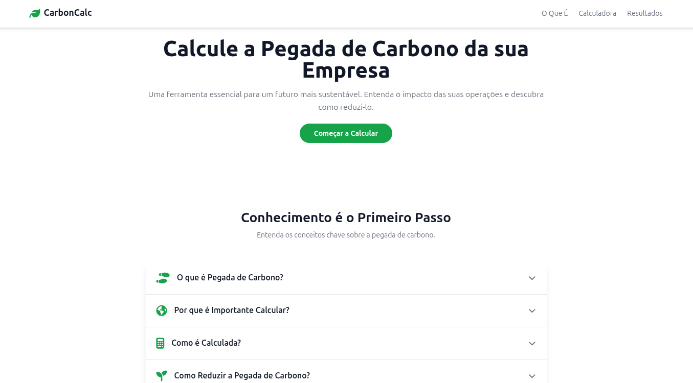
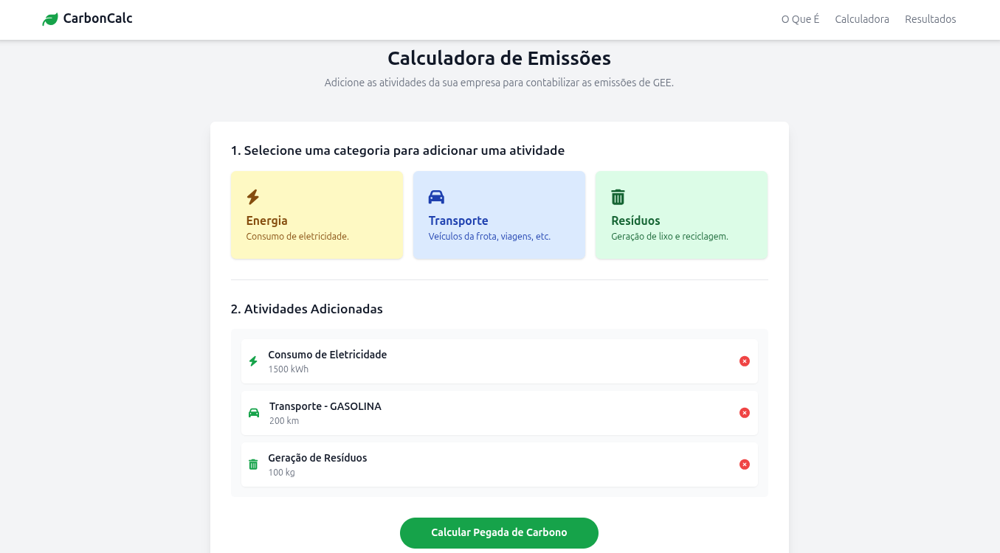
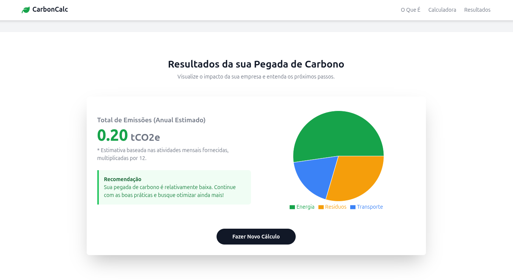

# Relatório do Projeto de Extensão I: Calculadora de Pegada de Carbono

**Curso:** Análise e Desenvolvimento de Sistemas  
**Instituição:** Descomplica  
**Aluno:** Israel Rodrigues de Jesus

---

## Sobre este projeto

Este projeto foi desenvolvido como parte da disciplina "Projeto de Extensão I" e teve como objetivo principal a criação de uma aplicação web interativa para calcular a pegada de carbono de empresas. A iniciativa visa aplicar os conhecimentos acadêmicos em desenvolvimento de sistemas para criar uma ferramenta de impacto social e ambiental, alinhada a diversos Objetivos de Desenvolvimento Sustentável (ODS) da ONU.

## Como acessar

Você pode acessar a versão online da aplicação através do seguinte link:

**[Acessar CarbonCalc](https://pex-carbon.vercel.app)**

### Screenshots do Projeto

  <em>Tela inicial e seção informativa</em> 
  

 

  <em>Interface da calculadora com modal de adição de atividade</em> 
  

 

  <em>Tela de resultados com gráfico e recomendações</em> 
  

## Descrição da Atividade

As atividades realizadas durante o desenvolvimento do projeto podem ser divididas nas seguintes etapas:

**1. Pesquisa e Planejamento:**
*   **Análise de Requisitos:** Estudo do tema "pegada de carbono" com base nos materiais de referência, como o artigo do site `bulbeenergia.com.br`, para compreender os conceitos, a importância e as metodologias de cálculo.
*   **Benchmarking:** Análise de ferramentas existentes, como a calculadora da SOS Mata Atlântica, para definir as funcionalidades essenciais e inspirar o design da interface do usuário (UI) e a experiência do usuário (UX).
*   **Definição da Arquitetura:** Planejamento da estrutura da aplicação utilizando React com TypeScript, componentizando a interface em seções lógicas: Cabeçalho, Seção Informativa, Calculadora e Resultados.
*   **Coleta de Dados:** Pesquisa por fatores de emissão de CO2 equivalentes (CO2e) para diferentes atividades (consumo de energia, tipos de transporte, geração de resíduos), baseando-se em fontes como o GHG Protocol e médias do setor.

**2. Desenvolvimento e Implementação (Front-End):**
*   **Configuração do Ambiente:** Estruturação do projeto com `index.html`, `TypeScript` e `Tailwind CSS` para estilização moderna e responsiva.
*   **Criação de Componentes:** Desenvolvimento de componentes React reutilizáveis para cada seção da página:
    *   `Header`: Navegação principal.
    *   `Hero`: Seção de boas-vindas para engajar o usuário.
    *   `InfoSection`: Um "accordion" interativo para explicar de forma didática o que é a pegada de carbono, sua importância, como é calculada e como reduzi-la.
    *   `Calculator`: O núcleo da aplicação, onde os usuários podem selecionar categorias (Energia, Transporte, Resíduos) e adicionar suas atividades através de um modal dinâmico.
    *   `Results`: Apresentação dos resultados com o total de emissões, uma recomendação personalizada e um gráfico de pizza (`recharts`) para visualização da distribuição das emissões por categoria.
    *   `Footer`: Rodapé com informações do projeto.
*   **Gerenciamento de Estado:** Utilização de hooks do React (`useState`, `useMemo`) para gerenciar a lista de atividades adicionadas pelo usuário, controlar a visibilidade dos modais e dos resultados, e para realizar os cálculos de forma eficiente.
*   **Lógica de Cálculo:** Implementação da lógica que multiplica os dados de entrada do usuário pelos fatores de emissão correspondentes para quantificar a pegada de carbono em kg de CO2e.
*   **Estilização e UX:** Foco em uma interface limpa, intuitiva e esteticamente agradável, utilizando `Tailwind CSS`. Foram adicionadas micro-interações e animações para tornar a experiência mais fluida e profissional.

**3. Testes e Refinamento:**
*   **Testes Funcionais:** Verificação de todas as funcionalidades, como adição e remoção de atividades, correção dos cálculos e interatividade dos componentes.
*   **Ajustes de UI/UX:** Refinamento do layout com base em testes de usabilidade, como a correção da cor dos inputs no modal para garantir a legibilidade.
*   **Responsividade:** Garantia de que a aplicação funcione e seja visualmente agradável em diferentes tamanhos de tela (desktop, tablet e mobile).

## Conclusões

A conclusão deste projeto é extremamente positiva, tendo alcançado todos os objetivos propostos. A aplicação "CarbonCalc" é uma ferramenta funcional, educativa e visualmente atraente que materializa a conexão entre a teoria acadêmica e a aplicação prática em prol de uma causa relevante.

Os principais aprendizados e resultados são:

*   **Aprendizado Técnico:** O projeto solidificou conhecimentos práticos em tecnologias de front-end modernas. A utilização de **React com TypeScript** aprimorou a habilidade de criar interfaces de usuário dinâmicas, componentizadas e com segurança de tipos. O **gerenciamento de estado** com hooks se mostrou essencial para a interatividade da calculadora. O uso de **Tailwind CSS** permitiu um desenvolvimento ágil de uma interface responsiva e customizada.
*   **Consciência Ambiental e Social:** O desenvolvimento aprofundou a compreensão sobre a crise climática e a importância da sustentabilidade corporativa. A pesquisa sobre os fatores de emissão e as estratégias de redução proporcionou uma visão clara do impacto das atividades humanas e do papel que a tecnologia pode desempenhar para mitigar esse impacto.
*   **Impacto do Projeto:** A ferramenta desenvolvida não é apenas um exercício técnico, mas uma solução de extensão com potencial real para ajudar pequenas e médias empresas a darem o primeiro passo na gestão de suas emissões de GEE. Ao simplificar o cálculo e fornecer informações claras, o projeto contribui para a conscientização e capacita os usuários a tomar decisões mais sustentáveis, alinhando-se diretamente aos ODS da ONU.
*   **Desenvolvimento de Soft Skills:** O projeto exigiu habilidades de pesquisa, planejamento, resolução de problemas e atenção aos detalhes, competências fundamentais para a carreira em Análise e Desenvolvimento de Sistemas.

Em suma, o Projeto de Extensão I foi uma experiência enriquecedora que resultou em um produto de software com propósito e qualidade.
